# DishDiary 🍳

<p align="center">
  
  
  
</p>

<p align="center">
  Your personal AI-powered recipe manager with smart meal planning, step-by-step cooking guidance, and nutrition tracking.
</p>

---

## ✨ Features

### 🤖 AI-Powered Cooking Assistant
- **Smart Recipe Generation**: Describe what you want to cook, and AI creates a complete recipe
- **Web-Grounded Recipes**: Uses Tavily API to fetch real recipes from the web
- **YouTube Recipe Import**: Extract recipes directly from YouTube cooking videos
- **Smart Emoji Attribution**: AI automatically adds appropriate emojis to ingredients and cooking steps

### 📋 Recipe Management
- Create, edit, and organize your personal recipe collection
- Add photos, ingredients with quantities, and detailed cooking steps
- Categorize by cuisine, meal type, or custom tags
- Search and filter recipes easily
- Share recipes with friends and family

### 📅 Weekly Meal Planning
- AI-generated personalized meal plans for the entire week
- Customizable based on:
  - Number of servings
  - Health goals (weight loss, muscle gain, maintenance)
  - Dietary preferences (vegetarian, vegan, keto, gluten-free, etc.)
  - Favorite cuisines
  - Ingredient exclusions
- Automatic shopping list generation grouped by category
- Nutrition tracking per meal and daily totals

### 🍳 Cooking Mode
- Step-by-step guided cooking experience
- Large, easy-to-read text
- Built-in timers for each step
- Text-to-Speech: Hands-free cooking guidance
- Keep screen awake during cooking
- Timer notifications

### 🔐 Authentication
- **Email/Password**: Traditional authentication
- **Google Sign-In**: Quick and easy access
- **Secure Storage**: API keys stored securely on device

### ☁️ Cloud Backup
- Google Drive backup and restore
- Export recipes to Excel format
- Automatic data protection

---

## 📱 Screenshots

<p float="left">
  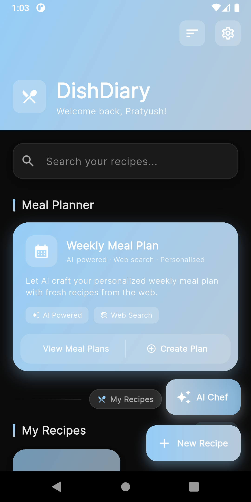
  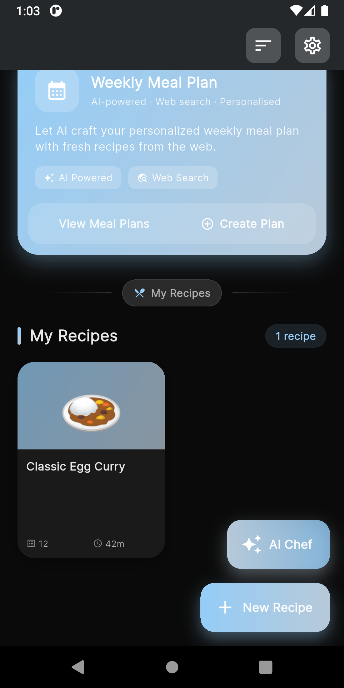
  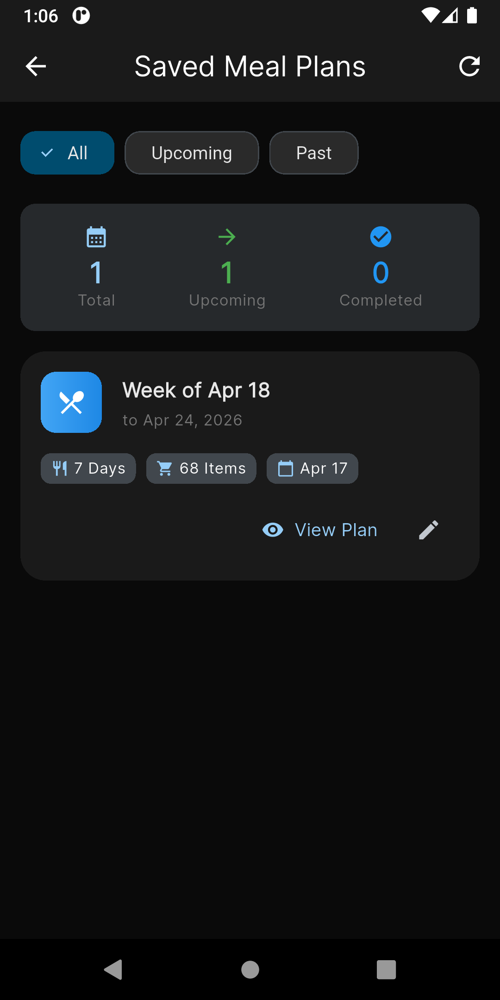
</p>

<p float="left">
  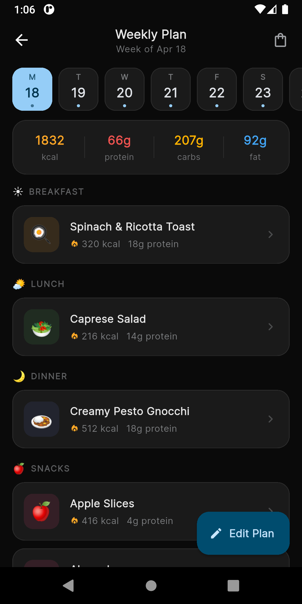
  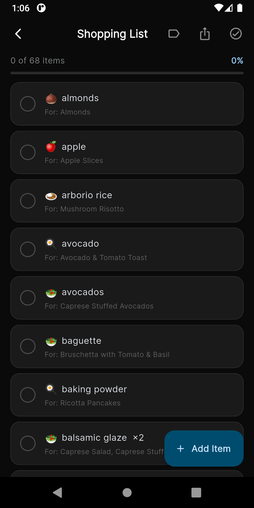
  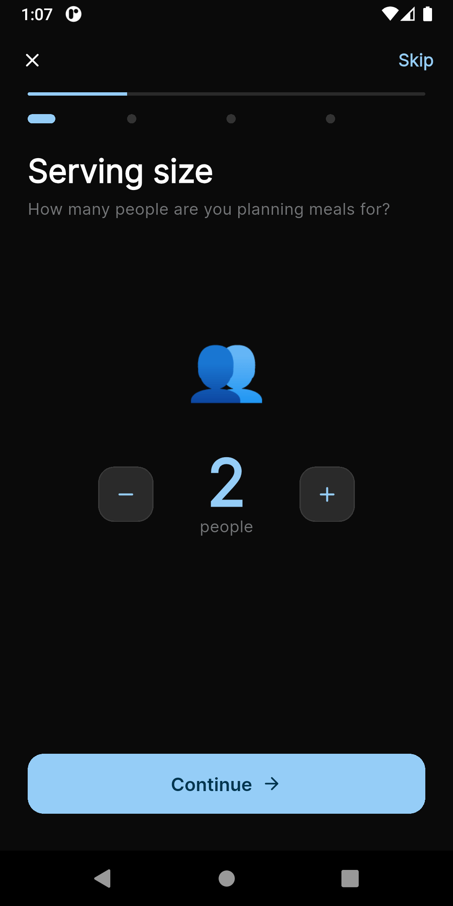
</p>

<p float="left">
  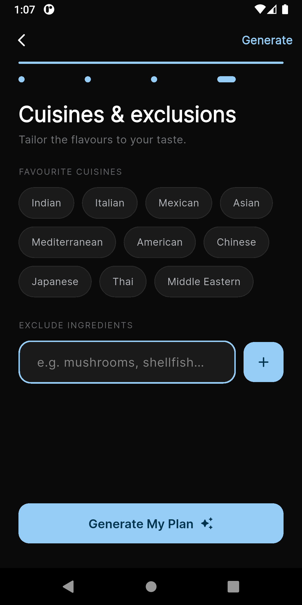
  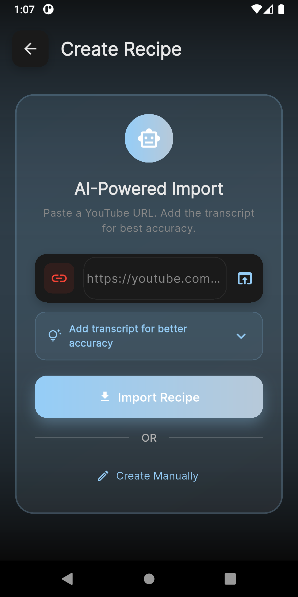
  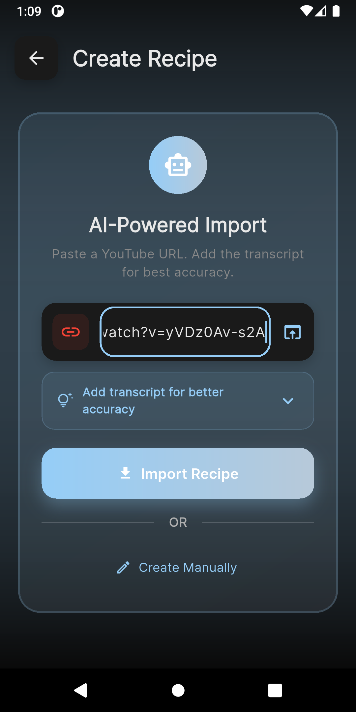
</p>

<p float="left">
  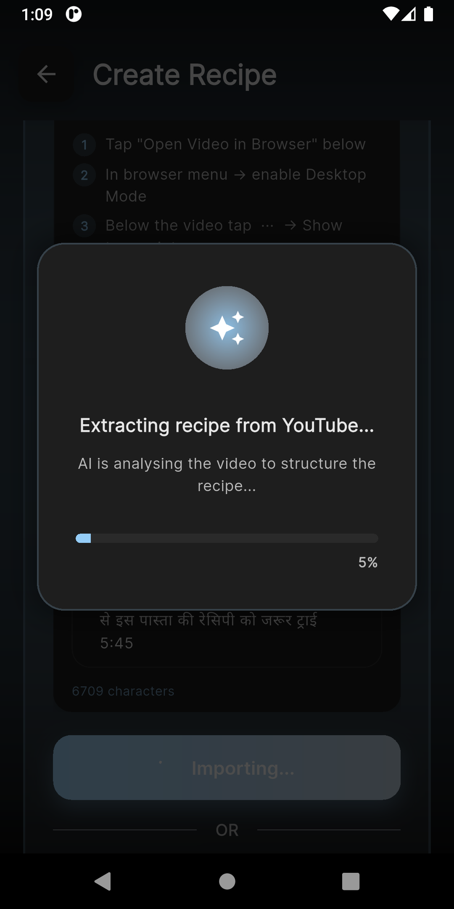
  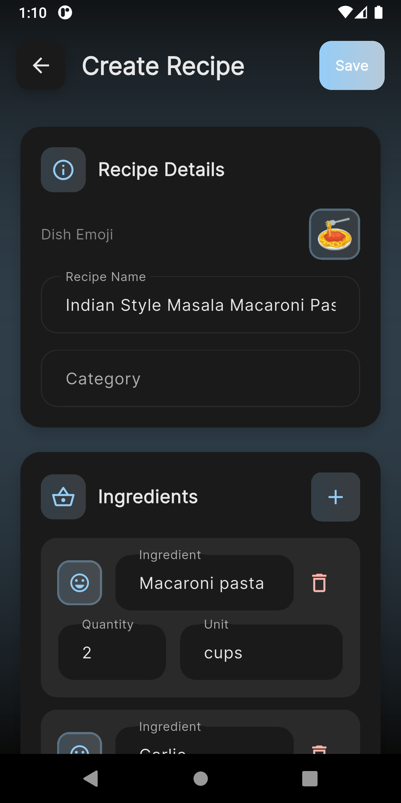
  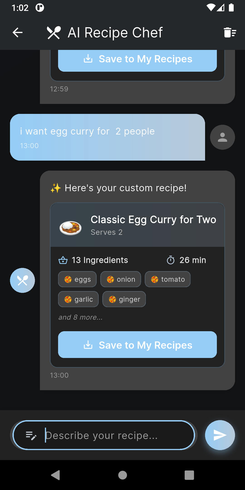
</p>

---

## 🚀 Getting Started

### Prerequisites

- **Flutter SDK**: 3.0.0 or higher
- **Dart SDK**: 3.0.0 or higher
- **Android SDK**: For Android builds
- **Xcode**: For iOS builds (macOS only)

### Installation

1. **Clone the repository**
   ```bash
   git clone https://github.com/yourusername/dishdiary.git
   cd dishdiary
   ```

2. **Install dependencies**
   ```bash
   flutter pub get
   ```

3. **Run the app**
   ```bash
   flutter run
   ```

### API Keys Setup

The app requires API keys for AI features:

| Service | Purpose | Required | Get Key |
|---------|---------|----------|---------|
| **Mistral AI** | Recipe generation & AI chat | Yes | [mistral.ai](https://mistral.ai) |
| **Tavily API** | Web-grounded recipe search | No | [app.tavily.com](https://app.tavily.com) |

To add your API keys:
1. Open the app
2. Go to **Settings** → **API Configuration**
3. Enter your Mistral API key (required)
4. Enter your Tavily API key (optional, enables web search)

---

## 🏗️ Architecture

```
lib/
├── core/                    # Core utilities and theme
├── features/                # Feature modules
│   ├── auth/               # Authentication (login, signup)
│   ├── chatbot/            # AI Cooking assistant
│   ├── home/              # Home screen
│   ├── meal_plan/         # Weekly meal planning
│   ├── onBoarding/        # First-time setup
│   ├── recipe/            # Recipe CRUD & cooking mode
│   └── settings/          # App settings
├── models/                 # Data models (Isar schemas)
├── providers/              # Riverpod state management
├── services/               # API & business logic
└── widgets/                # Reusable UI components
```

### Tech Stack

| Category | Technology |
|----------|------------|
| **Framework** | Flutter |
| **State Management** | Riverpod |
| **Local Database** | Isar |
| **AI** | Mistral AI |
| **Web Search** | Tavily API |
| **Authentication** | Firebase Auth / Google Sign-In |
| **Backup** | Google Drive |

---

## 📄 License

This project is licensed under the MIT License.

---

## 🙏 Acknowledgments

- [Mistral AI](https://mistral.ai) - For the powerful AI models
- [Tavily](https://tavily.com) - For web search capabilities
- [Flutter](https://flutter.dev) - For the amazing framework
- All open-source package contributors

---

## 📞 Support

If you encounter any issues or have questions:

1. **GitHub Issues**: [Open an issue](https://github.com/yourusername/dishdiary/issues)
2. **Discussions**: Start a discussion

---

<p align="center">
  Made with ❤️ using Flutter
</p>